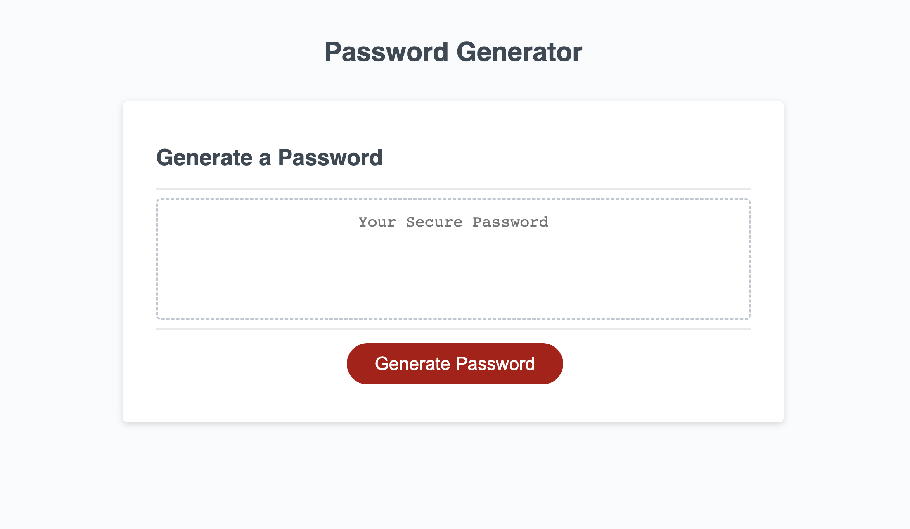

# password-generator

## Description
This app will generate a random password after the following series of prompts are answered by the user: 
* The length of the password ( between 8 and 128 characters )
* Uppercase, Lowercase , Numbers, or Special Characters ( must choose at least one type )

## Installation

N/A

## Links

Deployed app link: https://kaikim1996.github.io/password-generator/

## Usage

Screenshot of the application UI:

## License

See license in repo